# Greek Courier Services: Web Scraping & Exploratory Data Analysis (EDA)

## Project Overview
Αυτό το project δημιουργήθηκε με σκοπό την εξερεύνηση και την ανάλυση της ικανοποίησης των πελατών από τις 5 μεγαλύτερες* εταιρείες ταχυμεταφορών (courier) στην Ελλάδα (ACS, Courier Center, ELTA Courier, Geniki Taxydromiki, Speedex). 

Η ιδέα ήταν να συγκεντρωθούν πραγματικά δεδομένα από διάφορες πλατφόρμες προκειμένου να αποκτήσουμε μια αντικειμενική άποψη για τη συγκεκριμένη αγορά. Βασική επιδίωξη είναι να διερευνηθεί η συνολική εικόνα του κλάδου, να εντοπιστούν οι μοναδικές ιδιαιτερότητές της συγκεκριμένης αγοράς, και να κατανοήσουμε τους βαθύτερους λόγους δυσαρέσκειας των καταναλωτών. Το τελικό dataset αποτελείται από 5.658 "πλήρεις" εγγραφές, με το συνολικό average rating να βρίσκεται στο απογοητευτικό 1.73 / 5.

_\*Η Skroutz Last Mile εξαιρέθηκε, καθώς οι μόνες διαθέσιμες κριτικές online βρίσκονται στη σελίδα της κεντρικής εφαρμογής Skroutz. Οι κριτικές αυτές, στη συντριπτική τους πλειοψηφία, αφορούν τις αγορές και τα προϊόντα, και όχι την ίδια την υπηρεσία διανομής._

## Data Collection & Scraping Challenges
Δεν χρησιμοποιήθηκε κάποιο έτοιμο dataset. Τα δεδομένα συλλέχθηκαν μέσω προσαρμοσμένων Web Scraping scripts από 4 διαφορετικές πηγές: Google Maps (ReviewIt), AppStore, Google PlayStore και Trustpilot. Κατά τη διάρκεια του scraping αντιμετωπίστηκαν αρκετές προκλήσεις. Η κάθε πλατφόρμα διέθετε διαφορετικά DOM Structures, γεγονός που απαιτούσε διαφορετική προσέγγιση για την εξαγωγή του rating, της ημερομηνίας και του κειμένου. Παράλληλα, λόγω του Dynamic Loading, χρειάστηκε ειδική διαχείριση του infinite scrolling και του pagination για την πλήρη συλλογή των παλαιότερων κριτικών.

## Δομή των Δεδομένων (Datasets)
Για την πλήρη διαφάνεια της ροής εργασιών (Data Pipeline), το project συνοδεύεται από τρία βασικά αρχεία δεδομένων που αποτυπώνουν τα στάδια επεξεργασίας. Το πρώτο αρχείο είναι το 01_reviews_raw_consolidated.csv, το οποίο αποτελεί την ακατέργαστη (raw) συνένωση όλων των επιμέρους αρχείων ανά εταιρεία και πλατφόρμα, διατηρώντας το κείμενο και τα μεταδεδομένα ακριβώς όπως συλλέχθηκαν. Στη συνέχεια ακολουθεί το 02_reviews_cleaned.csv, όπου έχει πραγματοποιηθεί ο βασικός καθαρισμός, με αφαίρεση διπλότυπων εγγραφών, διαγραφή κενών κριτικών και τυποποίηση των ημερομηνιών. Τέλος, το 03_reviews_final_processed.csv αποτελεί το τελικό dataset επάνω στο οποίο βασίστηκε η ανάλυση. Πέρα από τα βασικά στοιχεία, περιλαμβάνει μια επιπλέον στήλη επεξεργασμένου κειμένου (cleaned_text) όπου έχουν αφαιρεθεί τα σημεία στίξης, οι ξενόγλωσσοι χαρακτήρες και το κείμενο έχει μετατραπεί σε πεζά, όντας πλήρως έτοιμο για εξόρυξη κειμένου και δημιουργία Word Cloud.

<pre>
📦 Courier_EDA_Project
 ┣ 📂 data
 ┃ ┣ 📄 01_reviews_raw_consolidated.csv
 ┃ ┣ 📄 02_reviews_cleaned.csv
 ┃ ┗ 📄 03_reviews_final_processed.csv
 ┣ 📂 images
 ┃ ┣ 📄 01_Sources.jpg
 ┃ ┣ 📄 02_Rating_Distribution.jpg
 ┃ ┣ 📄 03_Time_Series.jpg
 ┃ ┣ 📄 04_Time_Series_Spikes.jpg
 ┃ ┣ 📄 05_WordCloud_General.png
 ┃ ┣ 📄 06_WordCloud_ACS.png
 ┃ ┣ 📄 07_WordCloud_CourierCenter.png
 ┃ ┣ 📄 08_WordCloud_EltaCourier.png
 ┃ ┣ 📄 09_WordCloud_GenikiTaxydromiki.png
 ┃ ┗ 📄 10_WordCloud_Speedex.png
 ┗ 📄 README.md
</pre>

## Data Cleaning & Preprocessing
Το στάδιο του καθαρισμού ήταν ίσως το πιο απαιτητικό κομμάτι του project, καθώς τα raw data ήταν εξαιρετικά ανομοιογενή. 

Αρχικά, προέκυψε ζήτημα με το Date Parsing, καθώς οι πλατφόρμες επέστρεφαν ημερομηνίες σε μορφή κειμένου στα ελληνικά (π.χ. "14 Αυγούστου 2023"). Η βιβλιοθήκη Pandas αδυνατούσε να τις αναγνωρίσει (επέστρεφε `NaT`), οπότε δημιουργήθηκε ένα custom script με dictionary mapping για τη μετάφραση των μηνών στα Αγγλικά και την ασφαλή μετατροπή τους σε ISO datetime.

Ένα ακόμη σημαντικό βήμα ήταν το Language Translation & Text Normalization. Αρκετές κριτικές ήταν γραμμένες στα Αγγλικά, παρότι προέρχονταν από Έλληνες χρήστες (ένα συχνό φαινόμενο σε διεθνείς πλατφόρμες για να δώσουν μεγαλύτερη βαρύτητα και διεθνή ορατότητα στο παράπονό τους) ή σε Greeklish. Εντοπίστηκαν και μεταφράστηκαν μαζικά τα αγγλικά κείμενα στα ελληνικά, ώστε το κείμενο να είναι ομοιόμορφο. Στη συνέχεια, εφαρμόστηκε αυστηρή κανονικοποίηση μετατρέποντας τα Greeklish σε ελληνικά, αφαιρώντας τους τόνους και κάνοντας όλα τα γράμματα πεζά (lowercasing), ώστε να ομαδοποιηθούν σωστά όλες οι λέξεις κατά την ανάλυση στο Word Cloud.

Τέλος, πραγματοποιήθηκε το Data Consolidation, όπου ενοποιήθηκαν τα ετερόκλητα CSVs από τις διάφορες πηγές σε ένα τελικό, 100% "συμπαγές" dataset. Αφαιρέθηκαν οι διπλοεγγραφές καθώς και τα missing values, εξασφαλίζοντας την ποιότητα των δεδομένων πριν την ανάλυση.

## Exploratory Data Analysis Highlights
Με τα δεδομένα πλέον καθαρά, χρησιμοποιήθηκε το Power BI για την οπτικοποίηση και την εξαγωγή συμπερασμάτων:

### Πλατφόρμες Προέλευσης
Το Google Maps αποτελεί το βασικότερο πεδίο έκφρασης παραπόνων. Όταν παρατηρείται αστοχία, ο πελάτης τείνει να αξιολογεί αρνητικά το τοπικό κατάστημα/hub της περιοχής του.

 

  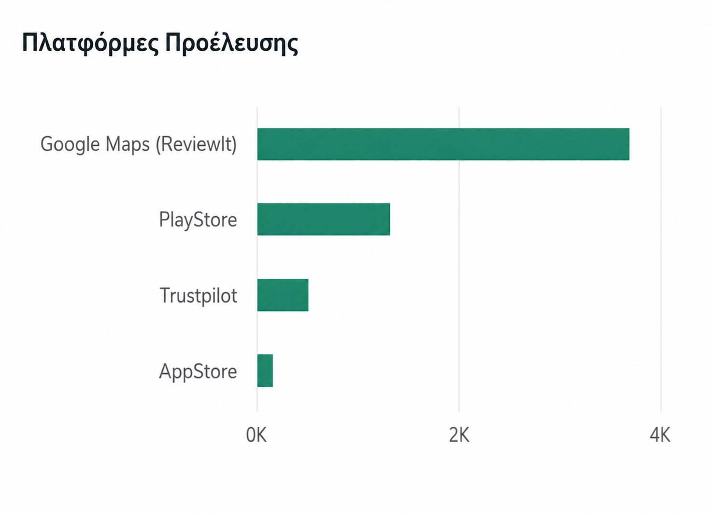

### Κατανομή Βαθμολογιών (Rating Distribution)
Εντυπωσιακή κυριαρχία των αρνητικών κριτικών, με το 78.35% του δείγματος να αφορά βαθμολογία 1 αστεριού. Αξίζει ωστόσο να σημειωθεί ότι αυτό το συντριπτικά αρνητικό ποσοστό ήταν ως έναν βαθμό αναμενόμενο. Στον κλάδο των ταχυμεταφορών, οι πελάτες σπάνια μπαίνουν στη διαδικασία να αξιολογήσουν μια φυσιολογική ή ομαλή παράδοση. Ο κύριος λόγος που οδηγεί κάποιον να αφήσει κριτική (negative selection bias) είναι για να εκφράσει ένα έντονο παράπονο ή μια κακή εμπειρία.

 

  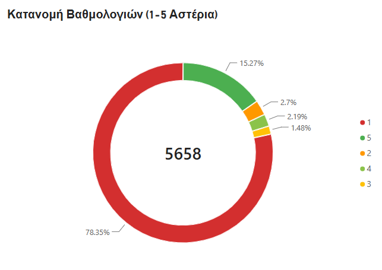

### Αξιολόγηση ανά Εταιρεία
Η Courier Center έχει τη συγκριτικά καλύτερη εικόνα (2.51/5), ενώ οι περισσότερες εταιρείες κινούνται οριακά πάνω από τον απόλυτο πάτο του 1.

 

  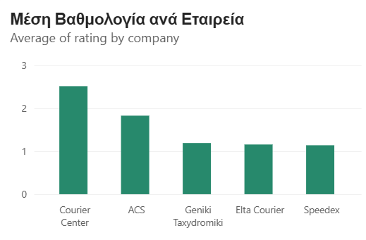

### Διαχρονική Εξέλιξη
Παρατηρήθηκαν ξεκάθαρες απότομες αυξήσεις κριτικών κατά τη διάρκεια συγκεκριμένων περιόδων όπου αυξάνεται κατακόρυφα ο όγκος δεμάτων ή προκύπτουν λειτουργικά προβλήματα.

Ο μήνας με τον μεγαλύτερο όγκο κριτικών στο σύνολο του dataset ήταν, με τεράστια διαφορά, ο Μάιος του 2025, όπου συγκεντρώθηκαν 579 κριτικές. Μάλιστα καταγράφηκαν ακραία ημερήσια spikes (π.χ. 57 κριτικές στις 8/5/2025). Εμβαθύνοντας στα δεδομένα, αποκαλύφθηκε κάτι εξαιρετικά ενδιαφέρον. Η συγκεκριμένη "έκρηξη" δεν αφορούσε παράπονα (όπως τον Δεκέμβριο), αλλά προερχόταν σχεδόν αποκλειστικά από την εταιρεία Courier Center (455 από τις 579 κριτικές), εκ των οποίων οι 306 ήταν 5-άστερες θετικές κριτικές στο Google Maps! Αυτό αποτελεί ξεκάθαρο αποτύπωμα μιας στοχευμένης προωθητικής καμπάνιας (Review Generation Campaign / SMS Prompt) που έτρεξε η συγκεκριμένη εταιρεία εκείνη την περίοδο, ζητώντας από ικανοποιημένους πελάτες να την αξιολογήσουν, "χαλώντας" προσωρινά το αρνητικό pattern του κλάδου.

Αντίθετα, η αμέσως επόμενη και απολύτως αναμενόμενη κορύφωση παρατηρείται κάθε Δεκέμβριο. Για παράδειγμα, τον Δεκέμβριο του 2024 και του 2025 καταγράφηκαν 314 και 298 κριτικές αντίστοιχα. Το τεράστιο backlog των αποθηκών που ξεκινάει από την Black Friday (τέλη Νοεμβρίου) και "σέρνεται" μέχρι τις γιορτές των Χριστουγέννων, αποτυπώνεται καθαρά στα δεδομένα με αρνητικά ρεκόρ (π.χ. 35 κριτικές σε μία μέρα στις 20/12/2024, και 26 κριτικές στις 10/12/2025).

Τέλος, παρατηρώντας το γράφημα, διακρίνονται δύο ακόμη ενδιαφέροντα μοτίβα. Αρχικά, ο απόηχος του Ιανουαρίου, όπου κάθε χρόνο καταγράφεται σταθερά υψηλός όγκος παραπόνων. Αυτό αποτελεί ουσιαστικά το hangover των εορτών, καθώς τα δίκτυα παλεύουν να ξεστοκάρουν τα δέματα του Δεκεμβρίου, ενώ παράλληλα εξυπηρετούν τον μεγάλο όγκο των επιστροφών και αλλαγών προϊόντων. Το δεύτερο μοτίβο αφορά την καλοκαιρινή πίεση του Ιουλίου. Παρατηρούνται μικρότερες αλλά διακριτές αυξήσεις κάθε Ιούλιο, οι οποίες πιθανότατα συμπίπτουν με τις θερινές άδειες του προσωπικού και δημιουργούν τοπικές αρρυθμίες στις παραδόσεις.

 

  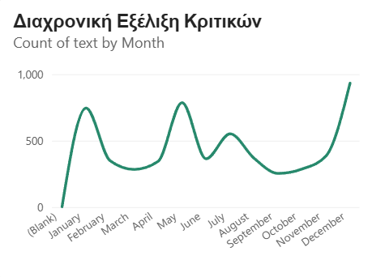

 

  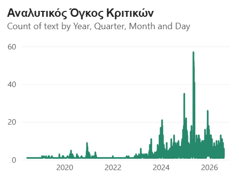

## Text Analytics (Word Cloud)
Αναπτύχθηκε ένα εκτενές και προσαρμοσμένο λεξικό αδρανών λέξεων (Custom Greek Stopwords Dictionary) για το σωστό φιλτράρισμα του κειμένου, επιτρέποντας την απομόνωση των πραγματικών αιτιών δυσαρέσκειας. Συγκεκριμένα, αφαιρέθηκαν οι εξής λέξεις: <small>και, το, τα, τη, την, της, του, των, στο, στη, στην, στα, στις, στους, από, απο, σε, με, για, να, που, πως, αν, ή, η, ο, οι, ένα, ενα, μια, μία, ενός, μιας, έναν, εγώ, εσύ, αυτό, αυτή, αυτά, αυτούς, αυτες, μου, σου, μας, σας, τους, τον, τι, ποιο, ποια, ποιος, κάτι, όλα, όλοι, όλο, κι, δεν, μην, μη, είναι, ειναι, ήταν, ηταν, έχει, εχει, έχουν, εχουν, έχω, εχω, είχα, ειχα, είχε, ειχε, είχες, είμαστε, είστε, θα, ότι, οτι, όπως, οπως, όταν, οταν, μετά, μετα, πάλι, παλι, ως, προς, ενώ, ενω, αλλά, αλλα, ακόμα, ακομα, πολύ, πολυ, έχεις, έχουμε, εχουμε, κάνω, κάνει, έκανα, εκανα, λέει, λένε, είπε, ειπε, είπαν, ειπαν, πήρα, πηρα, δέμα, δεμα, εταιρεία, εταιρεια, εταιρία, εταιρια, κούριερ, κουριερ, courier, acs, speedex, elta, ελτα, γενική, γενικη, ταχυδρομική, ταχυδρομικη, center, πακέτο, πακετο, package, delivery, parcel, παραγγελία, παραγγελια, παράδοση, παραδοση, τις, τισ, στον, ούτε, ουτε, γιατί, γιατι, υπάρχει, υπαρχει, απλά, απλα, αφού, αφου, εδώ, εδω, ήρθε, ηρθε, έρχεται, ερχεται, έρχονται, ερχονται, πάει, παει, πάω, παω, πάρω, παρω, καμία, καμια, πρέπει, πρεπει, μόνο, μονο, ξανά, ξανα, άλλο, αλλο, άλλη, αλλη, άλλες, αλλες, ίδιο, ιδιο, ίδια, ιδια, πάντα, παντα, σαν, εκεί, εκει, όχι, οχι, όλα, ολα, μέσα, μεσα, τελικά, τελικα, δε, δέματα, δεματα, δέματος, δεματος, χωρίς, χωρις, φορά, φορές, φορες, καν, κανένα, κανενα, κανείς, κανεις, τίποτα, τιποτα, πιο, έτσι, ετσι, κάθε, καθε, έγινε, εγινε, αστέρι, αστερι, αστέρια, αστερια, μηδέν, μηδεν, σήμερα, σημερα, ακόμη, ακομη, ήδη, ηδη, τώρα, τωρα, πίσω, πισω.</small>

Η αφαίρεση αυτού του τεράστιου όγκου κοινών ρημάτων, συνδέσμων, ονομάτων εταιρειών και γενικών όρων αποστολής ήταν κρίσιμη, καθώς οι λέξεις αυτές υπήρχαν σχεδόν σε κάθε κριτική και έπνιγαν οπτικά το Word Cloud.

Μετά τον καθαρισμό, η απομόνωση των λέξεων ανέδειξε ξεκάθαρα τις κορυφαίες 10 πιο συχνές λέξεις παραπόνων. Η λέξη "ποτέ" κυριαρχεί, υποδηλώνοντας δέματα που δεν έφτασαν ποτέ στον προορισμό τους. Ακολουθεί το "τηλέφωνο", καθώς η πιο κοινή αναφορά είναι ότι τα καταστήματα δεν απαντούν ποτέ στις κλήσεις. Ο χαρακτηρισμός "απαράδεκτοι" αποτελεί την πιο συχνή λέξη αγανάκτησης, ενώ το "σπίτι" εμφανίζεται διαρκώς δίπλα στο παράπονο ότι ο πελάτης βρισκόταν όλη μέρα στο σπίτι αλλά έλαβε ψευδές μήνυμα απουσίας. Η λέξη "χειρότερη" συνοδεύει συνήθως τη συνολική αξιολόγηση της εκάστοτε εταιρείας. Οι "μέρες" αποτυπώνουν τις εκτεταμένες καθυστερήσεις πολλών ημερών, ενώ η λέξη "χωρίς" συνδέεται άμεσα με το "χωρίς ειδοποίηση". Τέλος, λέξεις όπως "εξυπηρέτηση", "μήνυμα" και "χαρτάκι" συμπληρώνουν τη δεκάδα, αναδεικνύοντας την πλήρη έλλειψη επικοινωνίας και την πρακτική των διανομέων να αφήνουν ειδοποιητήρια χωρίς να χτυπήσουν το κουδούνι.*

 

  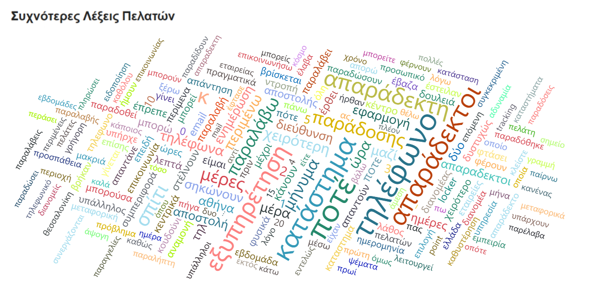

## Σύγκριση Ανά Εταιρεία (Comparative Word Clouds)

Η οπτική ανάλυση των συχνότερων λέξεων (Word Clouds) σε ατομικό επίπεδο ανά εταιρεία αναδεικνύει μοναδικά επιχειρησιακά προβλήματα, παρόλο που η βάση της δυσαρέσκειας παραμένει κοινή.

 

  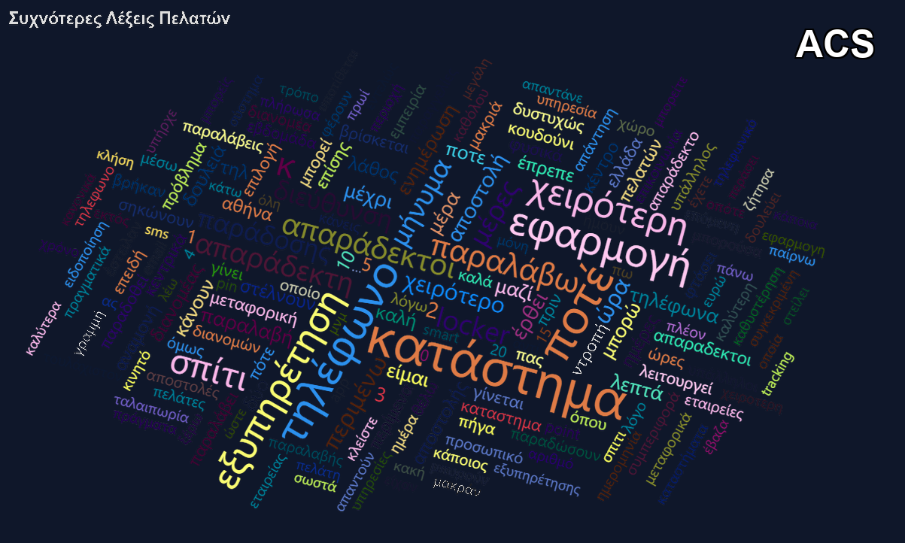

Στην περίπτωση της ACS, η έντονη εμφάνιση της λέξης Locker υποδεικνύει μια ξεκάθαρη στροφή στη στρατηγική παράδοσης. Οι πελάτες αναφέρουν συχνά ότι αντί για παράδοση στο σπίτι, λαμβάνουν απλώς ένα μήνυμα για παραλαβή από κάποιο αυτοματοποιημένο σημείο, γεγονός που δημιουργεί τριβές.

 

  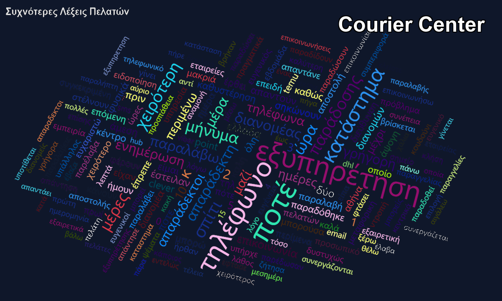

Η Courier Center αποτελεί τη μοναδική εξαίρεση όπου μια θετική λέξη, η λέξη Γρήγορη, κάνει τόσο αισθητή την παρουσία της. Το εύρημα αυτό επιβεβαιώνει την επιρροή των Review Campaigns που εντοπίστηκαν στην ανάλυση του χρόνου, δείχνοντας ότι υπάρχει μια στοχευμένη προσπάθεια εξισορρόπησης της δυσαρέσκειας.

 

  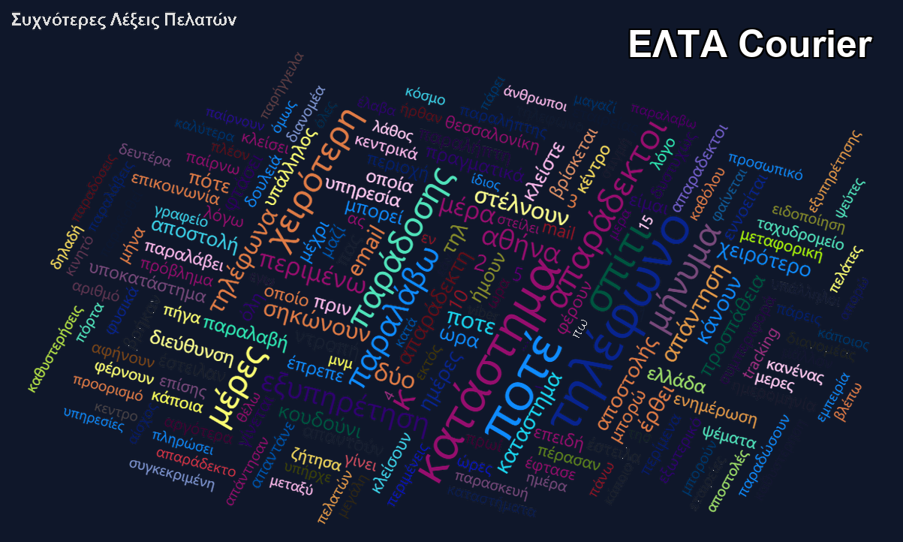

 

  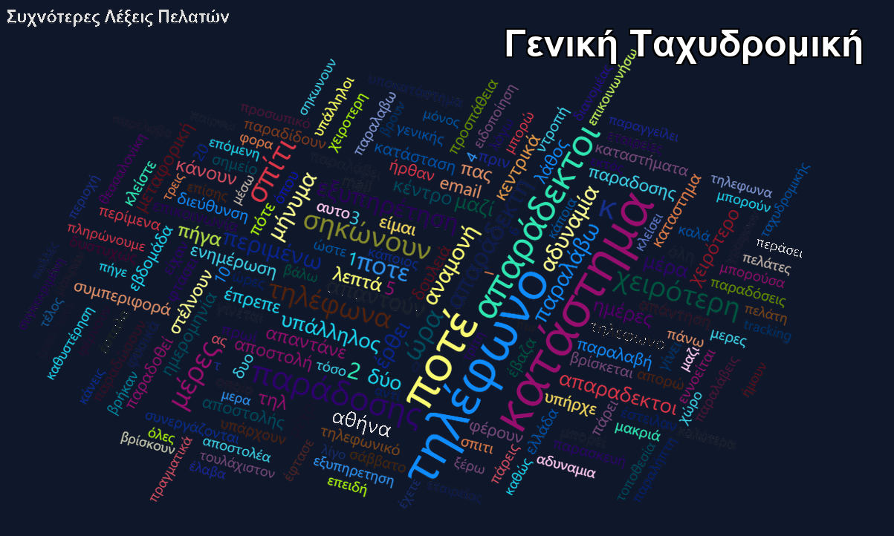

Για την Elta Courier και τη Γενική Ταχυδρομική, ο κοινός παρονομαστής είναι η απόλυτη έλλειψη επικοινωνίας. Λέξεις όπως Ποτέ και Σηκώνουν κυριαρχούν απόλυτα, δείχνοντας ότι το μεγαλύτερο λειτουργικό τους πρόβλημα εντοπίζεται στην τηλεφωνική υποστήριξη των τοπικών καταστημάτων.

 

  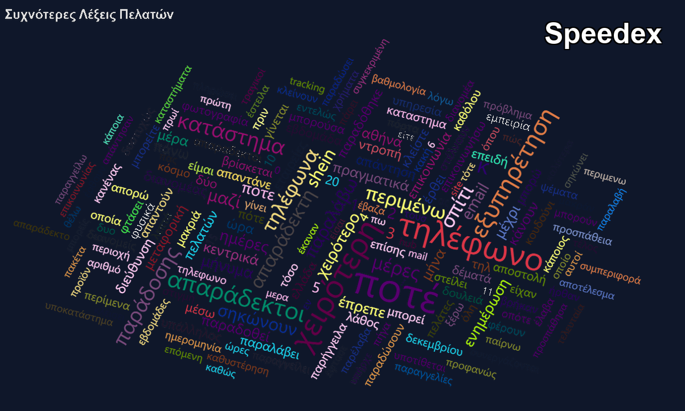

Τέλος, στη Speedex αναδεικνύεται ένα εντυπωσιακό εύρημα με την εμφάνιση του ονόματος Shein. Αυτό καταδεικνύει πώς ο τεράστιος όγκος φθηνών διεθνών μικροδεμάτων από πλατφόρμες e-commerce δημιουργεί σημαντικές καθυστερήσεις και δοκιμάζει τις αντοχές του δικτύου διανομής.

## Συμπέρασμα
Το συγκεκριμένο EDA επιβεβαιώνει data-driven αυτό που ίσως εμπειρικά είναι γνωστό: Ο κλάδος του Last-Mile Delivery στην Ελλάδα αντιμετωπίζει ένα συστημικό πρόβλημα στην Εξυπηρέτηση Πελατών, το οποίο προκύπτει κυρίως από επιχειρησιακά bottlenecks (πχ. αδυναμία επικοινωνίας) και όχι από την τιμολόγηση.

Πέρα από τα λειτουργικά προβλήματα, ένα κρίσιμο εύρημα της ανάλυσης είναι η τεράστια επίδραση του negative selection bias στην online εικόνα των εταιρειών. Οι πελάτες γράφουν κριτική σχεδόν αποκλειστικά όταν θέλουν να εκφράσουν τον θυμό τους για μια αποτυχία, αφήνοντας τη χαμηλότερη δυνατή βαθμολογία. Όπως αποδείχθηκε όμως από τα δεδομένα (π.χ. Μάιος 2025), όταν μια εταιρεία ζητά ενεργά αξιολόγηση μετά από μια επιτυχημένη παράδοση, τα ratings εκτοξεύονται, καθώς ενεργοποιείται η "σιωπηλή πλειοψηφία" των ικανοποιημένων πελατών.

Η προφανής λύση για τις εταιρείες θα ήταν η αυτοματοποιημένη αποστολή SMS με link αξιολόγησης αμέσως μετά την παράδοση του δέματος. Ωστόσο, στην Ελλάδα η συγκεκριμένη πρακτική εγκυμονεί τεράστιους κινδύνους και αποφεύγεται. Λόγω της μεγάλης έξαρσης του φαινομένου smishing (απάτες μέσω SMS όπου επιτήδειοι παριστάνουν γνωστές εταιρείες courier περιέχοντας κακόβουλα links), οι καταναλωτές είναι εξαιρετικά καχύποπτοι, ενώ και οι αρχές συμβουλεύουν το κοινό να μην πατάει ποτέ συνδέσμους σε SMS. Ως στρατηγική εναλλακτική για την ενίσχυση της εικόνας τους, προτείνεται η ενσωμάτωση αυτοματοποιημένων αιτημάτων αξιολόγησης αποκλειστικά μέσα από τις επίσημες mobile εφαρμογές (ειδοποιήσεις push) ή μέσα από το επίσημο περιβάλλον web tracking. Με αυτόν τον τρόπο διασφαλίζεται η εμπιστοσύνη του χρήστη, μηδενίζεται ο κίνδυνος απάτης, και η εταιρεία μπορεί να βελτιώσει ραγδαία την ψηφιακή της εικόνα, "ξεκλειδώνοντας" τις θετικές κριτικές που τώρα χάνονται.

Τέλος, προκύπτει ένα βαθύτερο δομικό συμπέρασμα που εξηγεί τη διαχρονική στασιμότητα του κλάδου. Η αγορά των ταχυμεταφορών στην Ελλάδα λειτουργεί ξεκάθαρα σε συνθήκες ολιγοπωλίου. Παρά την ύπαρξη εκατοντάδων μικρών αδειών, 5-6 μεγάλοι "παίκτες" (οι εταιρείες της ανάλυσής μας) ελέγχουν σχεδόν το 80% του όγκου. Σε αυτό το ολιγοπωλιακό περιβάλλον, ο πραγματικός "πελάτης" του courier είναι το e-shop (B2B) και όχι ο τελικός παραλήπτης (καταναλωτής). Εφόσον τα e-shops συνεχίζουν να επιλέγουν τον εκάστοτε courier με αυστηρά οικονομικά κριτήρια (τιμή ανά δέμα) και οι εναλλακτικές είναι μετρημένες στα δάχτυλα του ενός χεριού, δεν υπάρχει πραγματικό κίνητρο βελτίωσης της εξυπηρέτησης για τον τελικό καταναλωτή. Αυτός είναι και ο λόγος που οι εταιρείες δείχνουν να "μην νοιάζονται" για τις χιλιάδες αρνητικές κριτικές. Αντί να επενδύσουν σε περισσότερους οδηγούς ή τηλεφωνικά κέντρα (που αυξάνουν το λειτουργικό κόστος), προτιμούν πλέον να επενδύουν μαζικά σε Smart Lockers, με στόχο να καταργήσουν σταδιακά την κοστοβόρα παράδοση στο σπίτι (last-mile delivery) μετακυλίοντας το βάρος της παραλαβής στον ίδιο τον καταναλωτή.
